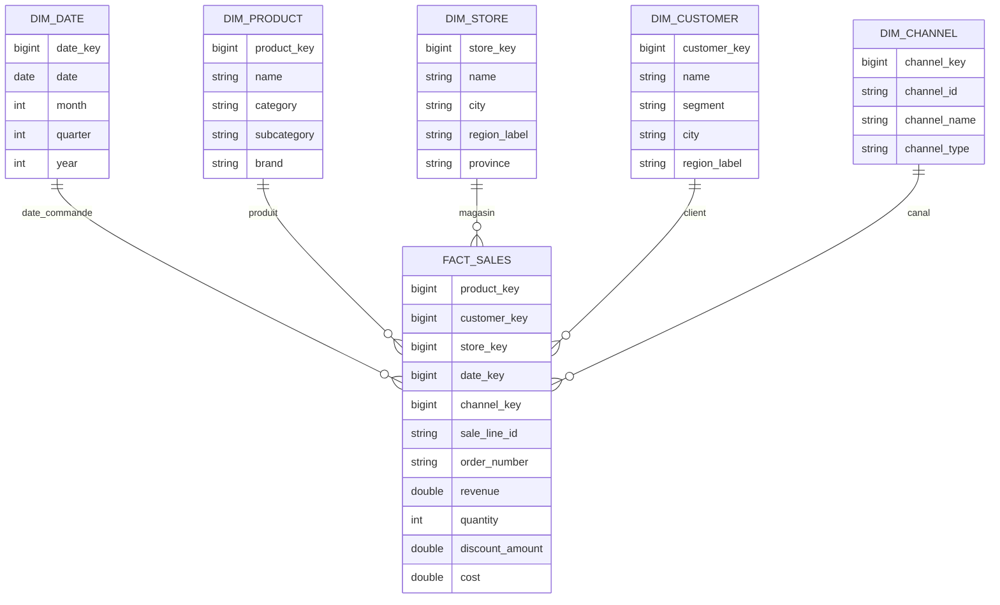

# Board Brief — S02 : Première étoile NexaMart

> **Question du cours (S02) :** quel schéma en étoile rend la question du CEO **répétable et fiable chaque mois** ?
>
> **Question opérationnelle (S01) :** quelles **catégories** de produits évoluent dans quelles **régions**, par **trimestre** ? Le schéma ci-dessous est la réponse structurelle pour la rejouer sans ambiguïté.

## Grain statement

**1 ligne = 1 ligne de commande**, identifiée par **`(order_number, sale_line_id)`**. **`order_number`** est une **dimension dégénérée** dans le fait (pas de table `dim_order`), conformément au [lab S02](../docs/lab-guides/GIS805-02_lab.md) et à [docs/s02-sample-brief.md](../docs/s02-sample-brief.md).

## Étoile construite

*(Alignée sur [diagrams/schema-v1.mmd](../diagrams/schema-v1.mmd) et [diagrams/schema-v1.drawio](../diagrams/schema-v1.drawio) : cinq FK substitut + `order_number` dégénérée.)*



- **Cinq dimensions** reliées par **`*_key`** : **`dim_date`**, **`dim_product`**, **`dim_store`**, **`dim_customer`**, **`dim_channel`**.
- **Mesures** : **`quantity`** et **`revenue`** (additives) ; **`discount_amount`** et **`cost`** (additives au niveau ligne).
- **Pas de clés naturelles** `product_id`, `store_id`, `customer_id`, `channel_id` dans le fait.

### Comment générer ce diagramme avec votre assistant IA

> *« Génère un diagramme Mermaid `erDiagram` pour mon étoile NexaMart S02 : `FACT_SALES` au grain ligne de commande (`order_number` + `sale_line_id`), mesures `revenue`, `quantity`, `discount_amount`, `cost`, FK `product_key`, `customer_key`, `store_key`, `date_key`, `channel_key`. Cinq dimensions : `dim_date`, `dim_product`, `dim_store`, `dim_customer`, `dim_channel`. Pas de dim_order. »*

Voir aussi [docs/visuals/star-schema.md](../docs/visuals/star-schema.md).

## SQL preuve

Fichier canonique : [sql/analysis/s02-first-answer.sql](../sql/analysis/s02-first-answer.sql).

```sql
SELECT
    p.category,
    s."région" AS region,
    d.quarter,
    SUM(f.revenue) AS total_sales,
    COUNT(*)       AS line_count
FROM fact_sales AS f
INNER JOIN dim_product AS p
    ON f.product_key = p.product_key
INNER JOIN dim_store AS s
    ON f.store_key = s.store_key
INNER JOIN dim_date AS d
    ON f.date_key = d.date_key
GROUP BY
    p.category,
    s."région",
    d.quarter
ORDER BY
    total_sales DESC;
```

| category | region | quarter | total_sales ($) | line_count |
|----------|--------|---------|-----------------:|-----------:|
| Pet Supplies | Ontario | 2 | 13 344,86 | 32 |
| Books & Media | Ontario | 2 | 12 649,16 | 36 |
| Books & Media | Québec | 3 | 10 119,30 | 31 |
| Books & Media | Ontario | 3 | 9 745,77 | 33 |
| Pet Supplies | Ontario | 3 | 9 661,49 | 28 |
| Books & Media | Ontario | 4 | 9 622,12 | 31 |
| Sports & Outdoors | Ontario | 2 | 9 257,49 | 56 |
| Toys & Games | Ontario | 4 | 8 984,90 | 34 |
| Toys & Games | Ontario | 1 | 8 824,15 | 34 |
| Pet Supplies | Québec | 1 | 8 510,21 | 21 |

*(Extrait : dix premières lignes par chiffre d’affaires décroissant ; **239** combinaisons catégorie × région × trimestre sur le seed actuel.)*

| Contrôle | Résultat |
|----------|----------|
| `SUM(revenue)` sur `fact_sales` ≈ `SUM(line_total)` sur `raw_fact_sales` | Oui (écart flottant négligeable) |
| Orphelins vers `dim_product`, `dim_store`, `dim_date`, `dim_customer`, `dim_channel` | 0 |
| Grain `(order_number, sale_line_id)` unique | Conforme (`validation/checks.sql`) |
| Pas de `product_id` / `store_id` / `customer_id` / `channel_id` dans `fact_sales` | Conforme |
| `order_number` présent (dimension dégénérée) | Oui |

## Réponse au CEO

Le schéma retenu est une **étoile ventes** à **cinq branches** : chaque mois, la même jointure `fact_sales` → dimensions répond à la question **catégorie × région × trimestre** via **`SUM(revenue)`**, sans reparser les CSV opérationnels. L’extrait SQL montre une **concentration** du chiffre d’affaires sur quelques combinaisons (ex. **Pet Supplies** et **Books & Media** en **Ontario**).

**Limite :** la colonne **`région`** côté client repose sur la **province** source.

**Recommandation :** industrialiser cette requête en vue ou modèle dbt ; en **S06**, croiser avec **`fact_returns`** (drill-across) pour distinguer baisse de demande et taux de retour élevé.

**Références :** [docs/schema-v1.md](../docs/schema-v1.md), [diagrams/schema-v1.mmd](../diagrams/schema-v1.mmd), [diagrams/schema-v1.drawio](../diagrams/schema-v1.drawio).
