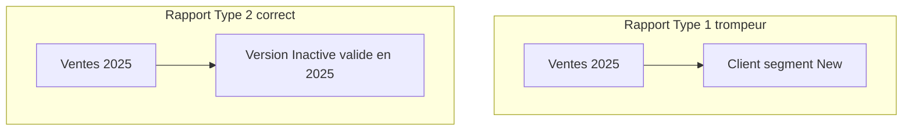

# Brief conseil — Politique SCD (S03)

## Question du CEO (S03)

Quels changements dans nos dimensions doivent garder la vérité historique, et lesquels peuvent être écrasés ?

## Réponse en une page

NexaMart distingue désormais les attributs **analytiques** (segment client, ville, province, région magasin), qui évoluent dans le temps et doivent être **historisés (SCD Type 2)**, des **correctifs sans impact décisionnel** (orthographe du nom, type de magasin), traités par **écrasement (SCD Type 1)**.

Sans historisation, un rapport « ventes par segment » attribue les achats passés au segment **d’aujourd’hui**. Sur nos données, le client **CUS-00152** voit **5 527 $** classés à tort sous **New** au lieu de **Inactive** ; à l’échelle réseau, le segment **Gold** est gonflé de **130 $** par rapport à la vérité au moment de la vente.

Le modèle retient des colonnes `valid_from`, `valid_to`, `is_current` et une **clé substitut par version**. Les ventes joignent la version du client valide à la **date de commande**, ce qui rétablit la confiance du conseil dans les tendances par segment et par région.

## Pourquoi c'est « board-ready »

- **Politique explicite** — tableau par attribut dans [`docs/scd-policy.md`](../scd-policy.md), pas une discussion informelle.
- **Preuve chiffrée** — comparaison Type 1 / Type 2 reproductible ([`sql/scd/type1_vs_type2_demo.sql`](../../sql/scd/type1_vs_type2_demo.sql)).
- **Décision CEO** — le conseil peut trancher : historiser tout attribut utilisé dans un filtre exécutif ; écraser seulement les corrections sans sens « avant / après ».

## Références techniques

- Politique : [`docs/scd-policy.md`](../scd-policy.md)
- Brief détaillé : [`answers/S03_executive_brief.md`](../../answers/S03_executive_brief.md)
- Dimensions : [`sql/dims/dim_customer.sql`](../../sql/dims/dim_customer.sql), [`sql/dims/dim_store.sql`](../../sql/dims/dim_store.sql)
- Pédagogie : [`docs/visuals/scd-type2-before-after.md`](../visuals/scd-type2-before-after.md)
