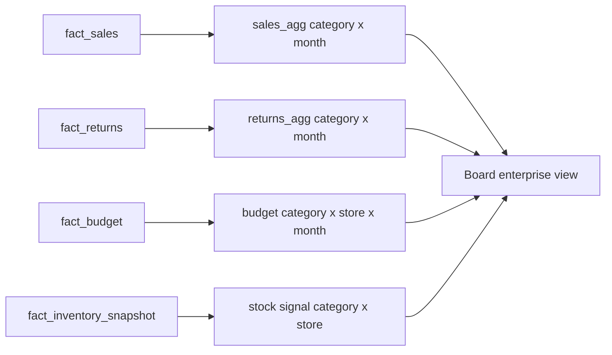

# Brief conseil — Vue entreprise intégrée (S07)

## Question du CEO (S07)

Le board peut-il voir ventes, retours, inventaire et budget dans une seule vue sans mentir ?

## Réponse en une page

Oui. NexaMart peut produire une vue consolidée à condition de respecter une règle stricte : **ne jamais joindre deux tables de faits directement**. Le modèle S07 utilise une bus matrix pour indiquer quelles dimensions sont conformes entre `fact_sales`, `fact_returns`, `fact_inventory_snapshot` et `fact_budget`.

La vue ventes × retours agrège chaque fait séparément au grain **catégorie × mois**, puis joint les résultats. Le signal principal est **Automotive — mars 2025** : **931,92 $** de remboursements sur **4 351,32 $** de ventes, soit **21,42 %**. La vue réel-vs-budget agrège les ventes au grain **catégorie × magasin × mois** : **Sports & Outdoors — NexaMart Calgary — mai 2025** est à **-100 916,21 $** de la cible.

L'inventaire est intégré comme quatrième fait, mais il reste semi-additif : on l'utilise pour repérer les snapshots sous seuil, pas pour sommer naïvement les stocks sur plusieurs dates.

## Pourquoi c'est board-ready

- **Dimensions conformes documentées** — la bus matrix indique quelles comparaisons sont permises.
- **Totaux réconciliés** — ventes, retours et budget conservent les mêmes totaux avant et après agrégation.
- **Décisions possibles** — le board peut prioriser Automotive (taux de retour) et revoir les cibles très au-dessus du réel.

## Références techniques

- Bus matrix : [`docs/bus-matrix.md`](../bus-matrix.md)
- Brief détaillé : [`answers/S07_executive_brief.md`](../../answers/S07_executive_brief.md)
- Drill-across : [`sql/integration/s07-drill-across.sql`](../../sql/integration/s07-drill-across.sql)
- Réel-vs-budget : [`sql/integration/s07-actual-vs-budget.sql`](../../sql/integration/s07-actual-vs-budget.sql)
- Réconciliation : [`sql/checks/s07-reconciliation.sql`](../../sql/checks/s07-reconciliation.sql)
