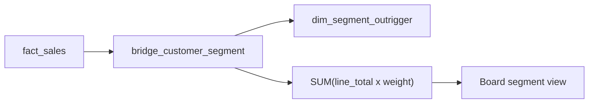

# Brief conseil — Risque de chevauchement des segments (S08)

## Question du CEO (S08)

Comment allouer les coûts et comprendre les segments clients qui se chevauchent sans double-compter ?

## Réponse en une page

Les segments NexaMart se chevauchent : un même client peut être `Platinum`, `New`, `Silver`, etc. Si le board joint directement `fact_sales` aux segments, chaque vente est répétée autant de fois que le client a de segments. Sur mon seed `team_3577855103`, cette erreur transforme **661 114,94 $** de ventes réelles en **885 282,55 $**, soit **224 167,61 $** de revenu fictif.

La règle de gouvernance est simple : tout rapport segmenté doit utiliser `bridge_customer_segment.weight`, et la somme des poids doit être **1,0** par `customer_key`. Avec cette méthode, le total pondéré réconcilie exactement avec le total réel : **661 114,94 $ = 661 114,94 $**.

## Ce que le board peut décider

- **Utiliser le pondéré pour les KPI financiers par segment.** C'est la seule méthode qui conserve le total réel.
- **Garder l'attribution primaire pour l'opérationnel.** Elle peut nommer un propriétaire de client, mais elle ne mesure pas correctement le chevauchement.
- **Interdire les jointures naïves dans les tableaux exécutifs.** Platinum est surestimé de **46 026,30 $** en dollars; Silver a le ratio de gonflement le plus élevé (**1,4408×**).
- **Suivre les coûts campagne par segment avec prudence.** Le coût campagne alloué total est de **217 510,80 $**; `planned_spend` est déjà alloué par ligne dans les données S08.

## Preuves techniques

- Pont pondéré : [`sql/bridges/bridge_customer_segment.sql`](../../sql/bridges/bridge_customer_segment.sql)
- Allocation segment : [`sql/bridges/s08-weighted-allocation.sql`](../../sql/bridges/s08-weighted-allocation.sql)
- Réconciliation : [`sql/checks/s08-weighted-reconciliation.sql`](../../sql/checks/s08-weighted-reconciliation.sql)
- Brief détaillé : [`answers/S08_executive_brief.md`](../../answers/S08_executive_brief.md)
