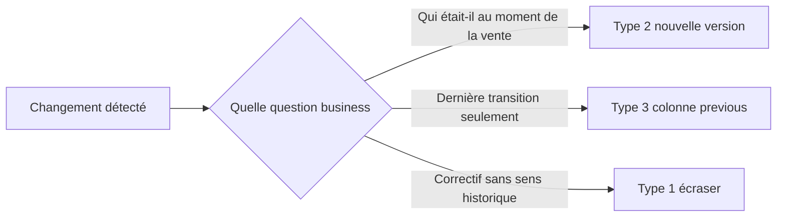

# Politique SCD — NexaMart

> **Question du CEO (S03) :** quels changements dans nos dimensions doivent garder la vérité historique, et lesquels peuvent être écrasés ?

## Principe directeur

Un attribut de dimension est historisé (**SCD Type 2**) lorsque le conseil doit pouvoir répondre : *« à quoi ressemblait le client ou le magasin **au moment de la vente** ? »*  
Il est écrasé (**SCD Type 1**) lorsque seule la valeur **actuelle** compte pour l’analyse, ou lorsqu’il s’agit d’une simple correction sans impact décisionnel.

La politique SCD est un **choix d’affaires**, pas un choix technique : elle protège la crédibilité des rapports exécutifs face aux changements opérationnels (segment, région, déménagement).

## Tableau de décision par dimension et attribut

| Dimension | Attribut | Type SCD | Justification business |
|-----------|----------|----------|------------------------|
| `dim_customer` | `segment` (fidélité) | **Type 2** | Le marketing et le CFO segmentent les campagnes et le chiffre d’affaires par niveau de fidélité **au moment de l’achat**. Un client passé de Inactive à New ne doit pas déplacer rétroactivement ses ventes passées. |
| `dim_customer` | `city` | **Type 2** | Les analyses géographiques et logistiques doivent refléter où vivait le client **lors de la commande**, pas sa ville actuelle. |
| `dim_customer` | `région` (province) | **Type 2** | Aligné sur les rapports régionaux du S01/S02 : une relocalisation interprovinciale ne doit pas réécrire l’historique des ventes. |
| `dim_customer` | `name` (correction orthographique) | **Type 1** | Corriger « Bélanger » → « BÉLANGER » n’altère pas le sens analytique ; une seule entité client, pas deux versions métier. |
| `dim_store` | `région` | **Type 2** | Le CEO compare les performances par région magasin ; un magasin réaffecté à une autre région ne doit pas transférer ses ventes historiques à la nouvelle région. |
| `dim_store` | `store_type` (flagship, express, etc.) | **Type 1** | Le format actuel du magasin intéresse la planification réseau, mais les ventes passées restent valides sans historiser chaque upgrade de type. |
| `dim_product` | `name`, `category`, `brand` | **Type 1** | Reclassements catalogue rares ; l’analyse produit porte sur l’offre **actuelle** sauf étude d’assortiment dédiée (hors périmètre S03). |
| `dim_date` | (toutes colonnes) | **N/A** | Dimension statique ; pas de changement lent. |
| `dim_channel` | (toutes colonnes) | **N/A** | Référentiel stable en S03. |

## Règle de décision

**Règle NexaMart :** en cas de doute sur un attribut utilisé dans un filtre ou un rapport agrégé (segment, région, ville), choisir **Type 2**.

## Colonnes ajoutées au schéma (Type 2)

| Colonne | Rôle |
|---------|------|
| `valid_from` | Date à partir de laquelle cette version est vraie |
| `valid_to` | Date de fin (NULL = version courante) |
| `is_current` | `TRUE` pour la version active dans les listes opérationnelles |
| `customer_key` / `store_key` | Clé substitut **par version** — les faits pointent vers la version valide à la date de la vente |

## Implémentation

- Dimension client : [`sql/dims/dim_customer.sql`](../sql/dims/dim_customer.sql) — événements `raw_customer_changes`
- Dimension magasin : [`sql/dims/dim_store.sql`](../sql/dims/dim_store.sql) — `region_reassign` en Type 2, `type_upgrade` en Type 1
- Démonstration : [`sql/scd/type1_vs_type2_demo.sql`](../sql/scd/type1_vs_type2_demo.sql)
- Visualisation pédagogique : [`docs/visuals/scd-type2-before-after.md`](visuals/scd-type2-before-after.md)

## Références

- Kimball — [Type 1, 2, 3](https://www.kimballgroup.com/data-warehouse-business-intelligence-resources/kimball-techniques/dimensional-modeling-techniques/type-1-2-3/)
- Lab S03 : [`lab-guides/GIS805-03_lab.pdf`](../lab-guides/GIS805-03_lab.pdf)
