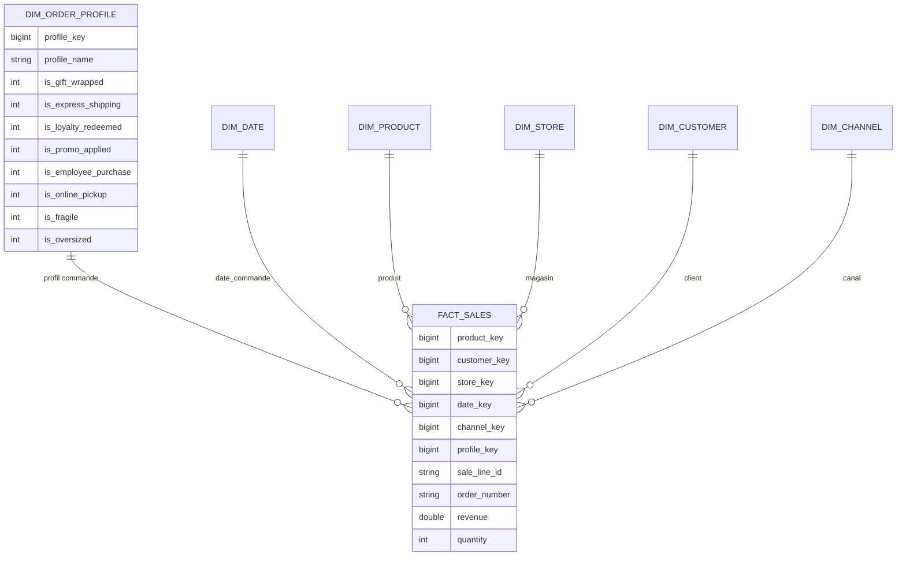

# Schéma en étoile NexaMart — version 2 (S04)

## Portée

Extension du schéma [S02 (schema-v1.md)](schema-v1.md) et [S03 (SCD)](scd-policy.md) avec une **junk dimension** (`dim_order_profile`) et la conservation de **`order_number`** comme dimension dégénérée dans `fact_sales`.

- Lab : [GIS805-04_lab.md](lab-guides/GIS805-04_lab.md)
- Profils observés : [profiles.md](profiles.md)
- Analyse panier : [sql/analysis/basket_pairs.sql](../sql/analysis/basket_pairs.sql)
- Brief conseil : [board-briefs/s04-basket-flags.md](board-briefs/s04-basket-flags.md)

## Modèle cible (S04)

## Grain statement (inchangé)

**Une ligne dans `fact_sales` = une ligne de commande.** Grain vérifiable : **`(order_number, sale_line_id)`**.

## Table de faits `fact_sales` (S04)

| Rôle | Colonnes |
|------|-----------|
| FK substitut | `product_key`, `customer_key`, `store_key`, `date_key`, `channel_key` |
| FK junk (optionnelle) | `profile_key` → `dim_order_profile` (via `raw_orders` + drapeaux) |
| Identité de grain | `sale_line_id` |
| Dimension dégénérée | `order_number` (pas de `dim_order`) |
| Mesures | `revenue`, `quantity`, `discount_amount`, `cost`, `line_total` |

`profile_key` est rempli lorsque `order_number` existe dans `raw_orders` (jeu S04). Les autres commandes du fait conservent `NULL` — couverture partielle documentée dans le brief S04.

## Junk dimension `dim_order_profile`

| Colonne | Description |
|---------|-------------|
| `profile_key` | Clé substitut (une par combinaison de drapeaux observée) |
| `profile_name` | Libellé VP (« Commande standard », « Promo fidélité », …) |
| `is_*` (×8) | Drapeaux booléens consolidés (0/1) |

**Règle Kimball :** aucune mesure dans la junk dimension — seulement des descriptifs.

**Cardinalité :** au plus **256** combinaisons théoriques (2⁸ drapeaux) ; sur notre seed, **99** combinaisons distinctes observées dans `raw_orders` (voir [profiles.md](profiles.md)).

## Couche physique

1. `raw_orders` — CSV S04 (`orders.csv`) avec 8 drapeaux par commande.
2. [sql/dims/dim_order_profile.sql](../sql/dims/dim_order_profile.sql) — `SELECT DISTINCT` des flags + nommage.
3. [sql/facts/fact_sales.sql](../sql/facts/fact_sales.sql) — `LEFT JOIN raw_orders` puis `dim_order_profile`.

## Decision log — S04

| Date | Décision | Justification |
|------|----------|---------------|
| 2026-05 | Junk dim vs 8 colonnes dans le fait | 256 combinaisons théoriques ; 99 observées — une FK + noms VP lisibles. |
| 2026-05 | `order_number` reste dégénérée | Pas d’attributs commande hors drapeaux ; sert au panier (self-join). |
| 2026-05 | `profile_key` nullable | Ventes S06 et commandes S04 partagent le format `ORD-*` mais pas toutes les commandes ont des drapeaux S04. |
